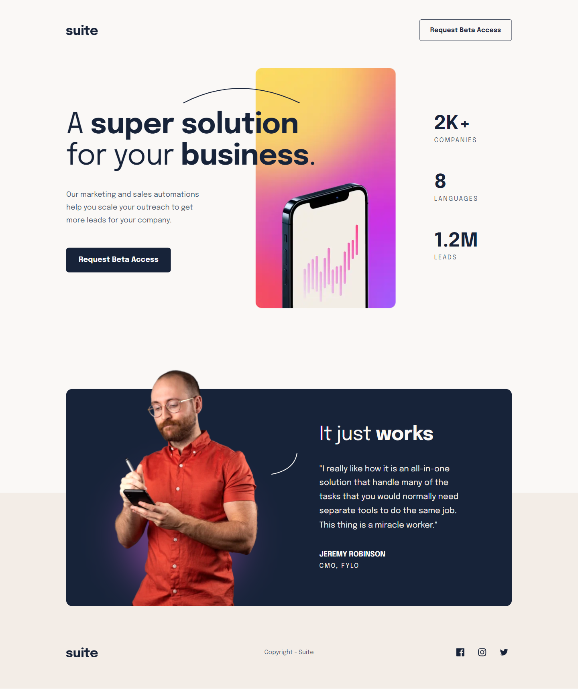

# Frontend Mentor - Suite landing page solution

This is a solution to the [Suite landing page challenge on Frontend Mentor](https://www.frontendmentor.io/challenges/suite-landing-page-tj_eaU-Ra). Frontend Mentor challenges help you improve your coding skills by building realistic projects.

## Table of contents

  - [Overview](#overview)
    - [The challenge](#the-challenge)
    - [Screenshot](#screenshot)
    - [Links](#links)
  - [Author](#author)

## Overview

### The challenge

Users should be able to:

- View the optimal layout depending on their device's screen size
- See hover states for interactive elements

### Screenshot

### Links

- Solution URL: [Frontend Mentor Solution Page](https://www.frontendmentor.io/solutions/suite-landing-page-Gm1akqjngy)
- Live Site URL: [Github Pages](https://jumiranda5.github.io/fm-junior-suite-landing-page/)

## Author

- Frontend Mentor - [@jumiranda5](https://www.frontendmentor.io/profile/jumiranda5)

## Acknowledgments

This [youtube video](https://www.youtube.com/watch?v=fp9eVtkQ4EA) from [web dev simplified](https://www.youtube.com/@WebDevSimplified) was helpful to understand img srcset.